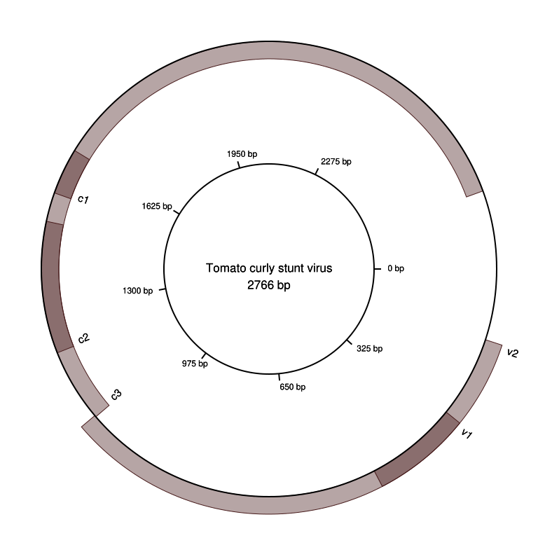

# ACM Research Coding Challenge (Spring 2021)

## Result

 
 
Features start at the location of feature labels and continue counter-clockwise. Areas with darker shading indicate regions where features overlap.

## Overview

Image generation is performed by GenMapper, which was built using .NET Core 3.1 and uses the [VectSharp](https://github.com/arklumpus/vectsharp) vector graphics library. GenMapper.exe takes two arguments - the input path of the .gb file, and the output path of the resulting .PNG image.

## Implementation Details

.gb files are read via the ASCIILineReader class, which offers better performance than .NET's native StreamReader. Parsing of the .gb file is performed by the GenbankReader class, which only parses feature locations and the organism name and ignores all other data. No Regex or external parsing libraries are used. The image itself is generated using the CircleMapper class.
